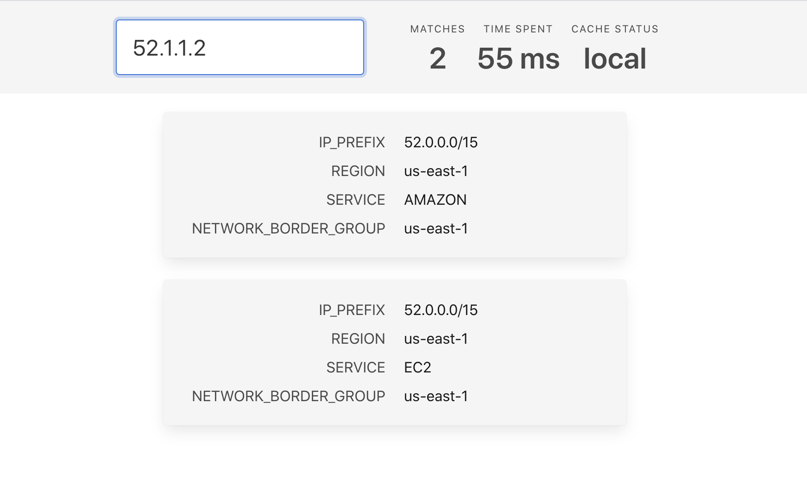

# AWS Region Finder

## What is it

AWS resource's region lookup by its public IP address.

## How does it work

The service is using the following [AWS API call](https://ip-ranges.amazonaws.com/ip-ranges.json) behind the scenes to retrieve the latest CIDR database of all AWS services.

## How to use it

You just need to pass **"ip"** parameter of the AWS IP address you are looking for.

In response you will get a set of **matches** (if it is a valid AWS IP address), including its CIDR group, region, and service associated with it.

Additionally, there is a field called **"requested_ip"** which is simply echoing the IP address you are trying to look up.

**"cache_status"** reports its status about cached CIDR datastore. Values can be either **"LOCAL"** _(meaning it is stored in RAM memory)_, or a value of **"cf-cache-status"** header _(you can read more about [Cloudflare's "CF-Cache-Status" mechanics](https://support.cloudflare.com/hc/en-us/articles/200172516-Understanding-Cloudflare-s-CDN))_.

## Web UI

Web UI is available [here](https://aws-ui.home-cloud.workers.dev)

[](https://aws-ui.home-cloud.workers.dev)

## cURL example

```bash
curl "https://aws.home-cloud.workers.dev/?ip=52.1.1.1"
```

```json
{
  "requested_ip": "52.1.1.1",
  "cache_status": "local",
  "matches": [
    {
      "ip_prefix": "52.0.0.0/15",
      "region": "us-east-1",
      "service": "AMAZON",
      "network_border_group": "us-east-1"
    },
    {
      "ip_prefix": "52.0.0.0/15",
      "region": "us-east-1",
      "service": "EC2",
      "network_border_group": "us-east-1"
    }
  ]
}
```

___

API service was built on a [Cloudflare Workers](https://workers.cloudflare.com) serverless platform
